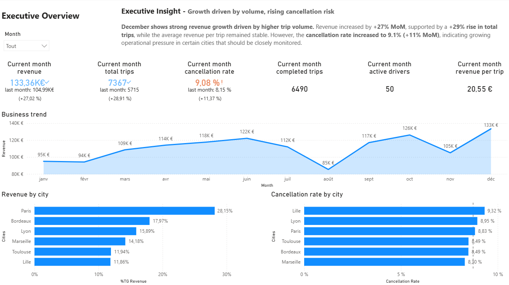
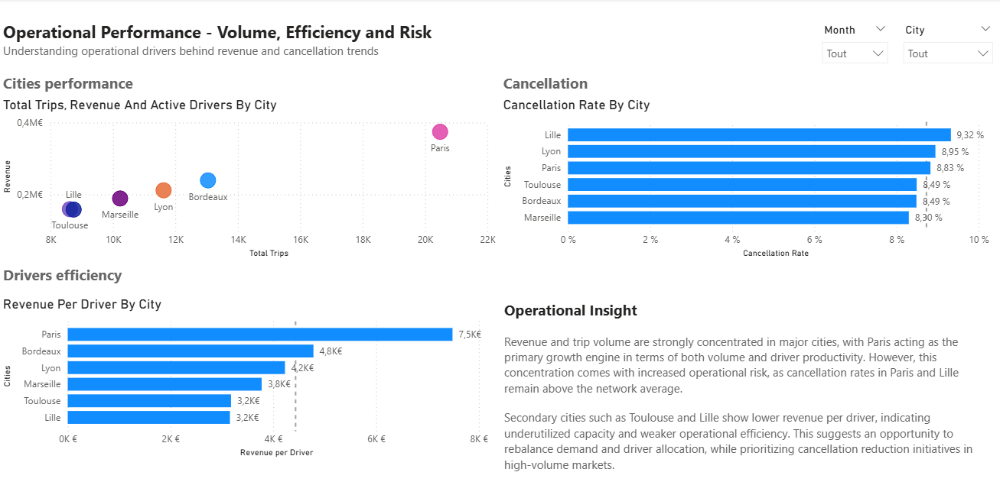
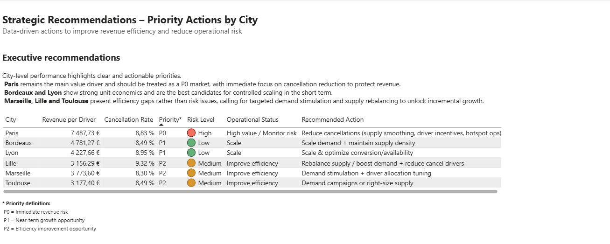

# 🚕 Mobility Operations Performance Dashboard

End-to-end data analytics project analyzing operational performance, cancellation risk, and efficiency for a mobility marketplace using SQL and Power BI.

---

## 🎯 Objective
Provide actionable insights to monitor city-level performance, identify operational risks, and support data-driven prioritization for a mobility platform.

---

## 🧠 Business Context
Rapid growth in trip volume can hide operational inefficiencies such as rising cancellation rates or decreasing driver efficiency.  
This project helps decision-makers identify where to focus attention and which actions should be prioritized.

---

## ❓ Key Business Questions
- Which cities drive the majority of revenue and trip volume?
- Where is cancellation risk increasing?
- What are the main causes of cancellations?
- Which cities require immediate action versus monitoring?

---

## 📦 Dataset
- Type: Synthetic dataset inspired by real-world mobility operations
- Granularity: One row per trip
- Main entity: trips
- Key dimensions: time, city, driver
- Status values:
  - completed  
  - cancelled_by_customer  
  - cancelled_by_driver  
  - no_show  

---

## 🏗️ Data Model
The project uses a simple and efficient fact-based model:
- **fact_trips**: trip-level operational data

Business rules:
- Revenue is generated only for completed trips
- Cancelled and no-show trips generate zero revenue

---

## ⚙️ Methodology
1. Data schema definition (`01_create_tables.sql`)
2. Data cleaning and standardization (`02_data_cleaning.sql`)
3. Data enrichment and KPI-ready transformations (`03_transformations.sql`)
4. Business KPI queries (`04_kpi_queries.sql`)
5. Visualization and storytelling in Power BI

---

## 📊 Dashboard Overview
The Power BI dashboard is structured into three pages:
- **Executive Overview**: high-level performance and trends
- **Operational Performance**: city-level volume, revenue, and risk indicators
- **Strategic Recommendations**: operational status and priority actions (P0 / P1 / P2)

---

## 📊 Dashboard Screenshots

### Executive Overview
High-level view of revenue, trip volume, and cancellation trends, designed for executive decision-making.

---

### Operational Performance
City-level analysis of volume, efficiency, and cancellation risk to identify operational pressure points.

---

### Strategic Recommendations
Action-oriented view translating performance metrics into operational status and priority levels (P0 / P1 / P2).

---

## 🔍 Key Insights
- Revenue growth is primarily driven by increased trip volume
- High-revenue cities can also present elevated cancellation risk
- Cancellations are mainly driven by customer and driver behavior rather than system failures

---

## 🧭 Recommendations
- **P0**: Immediate action in high-revenue cities with rising cancellation rates
- **P1**: Monitor performance and stabilize driver supply in growth markets
- **P2**: Optimize efficiency in stable, lower-risk cities

---

## 🔁 Reproducibility
1. Execute SQL scripts located in the `/sql` folder in numerical order
2. Open the Power BI file located in `/powerbi`
3. Refresh data connections if needed

---

## 🚀 Next Steps
- Add predictive indicators for cancellation risk
- Integrate city metadata (population, supply size)
- Automate data refresh and alerting
  
---

## ⚠️ Limitations & Trade-offs

This project was intentionally designed to balance analytical depth, clarity, and portfolio relevance. The following limitations and trade-offs were consciously made:

### Data Scope
- The dataset is synthetic and does not include real user behavior or financial constraints.
- No customer-level lifecycle analysis (retention, churn, LTV) is possible with the available data.
- City metadata (population, driver supply size) is not included, limiting deeper contextual analysis.

### Modeling Choices
- A single fact table (`fact_trips`) was used to keep the model simple and readable.
- City and driver dimensions were not normalized into separate tables to avoid unnecessary complexity for a portfolio project.
- Business rules (e.g. revenue only for completed trips) were enforced explicitly for KPI consistency.

### Analytical Trade-offs
- Cancellation analysis focuses on operational risk rather than behavioral causality.
- Thresholds used for operational status and prioritization are illustrative and would normally be refined with domain experts.
- No predictive modeling was implemented; the analysis remains descriptive and diagnostic.

### Visualization Scope
- The dashboard prioritizes decision-making and actionability over exhaustive metric coverage.
- Some KPIs could be further segmented (time of day, driver tenure, distance buckets) to deepen insights.

These trade-offs were made deliberately to ensure the project remains clear, actionable, and aligned with real-world data analyst responsibilities.
